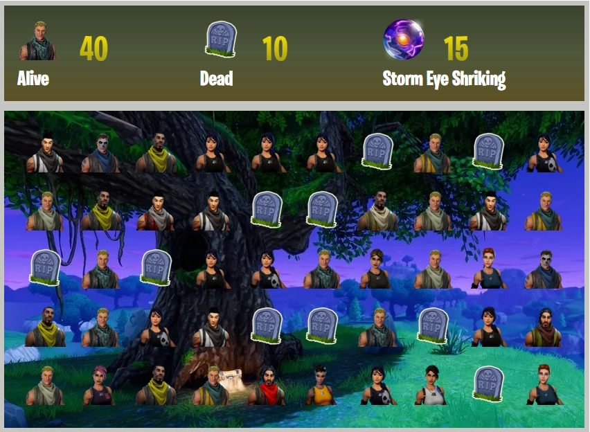

# FortScript :boom:


```diff
- Este jogo ainda está em desenvolvimento.

```

FortScript é um jogo simples, desenvolvido em JavaScript apenas para testar os primeiros conhecimentos que adquiri nesta linguagem de programação.
A logica do jogo foi baseada em um jogo de estourar balões, onde o jogador tem um determinado numero de segundos para estourar uma quantidade X de balões.

O jogo é inspirado no game FortNite - Save the World e Battleroyale. 


